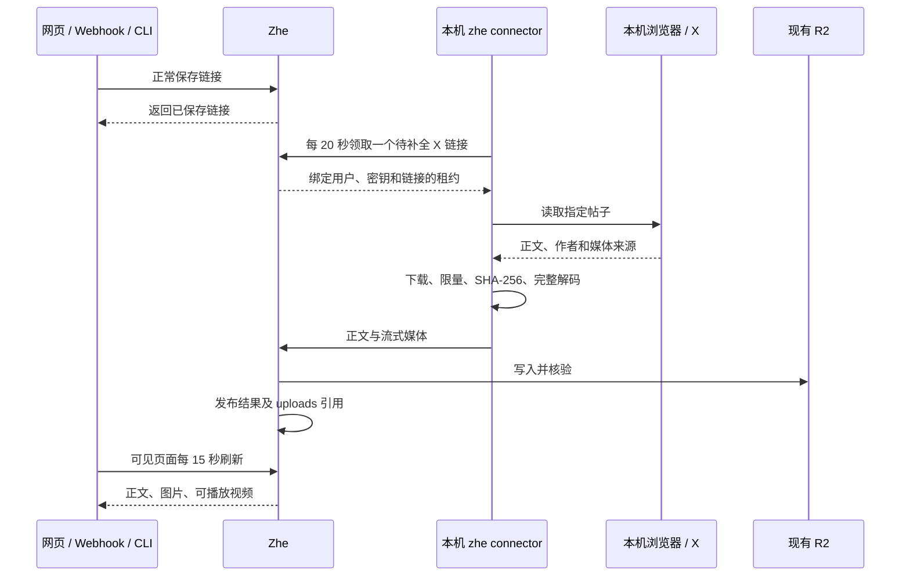

# X 书签与本机 Connector

Zhe 先按原流程保存链接。网页、Webhook、REST API 和 CLI 创建的 X 帖子链接都会被本机 Connector 发现；本机在线时，正文和媒体会在几分钟内出现在原来的链接卡片中。Connector 是 `@nocoo/zhe` 的子命令，复用 `zhe login`，不需要 LLM。

## 安装与使用

需要 Node.js ≥ 22.16、FFmpeg / ffprobe，以及已连接 OpenCLI 扩展并登录 X 的浏览器。OpenCLI 作为固定版本依赖随 CLI 安装。

当前机器已从验证过的安装包完成全局安装，可直接运行 `zhe connector status`。此次升级的 npm 公开发布尚待账号二次认证；发布完成前，下方 `npm install` 命令仍会取得旧版，不能用于安装本次 Connector 功能。最新验收与发布状态见 [GOAL.md](../GOAL.md)。

```sh
npm install -g @nocoo/zhe
zhe login
zhe connector status
zhe connector start
```

同一个 API Key 至少选择 `links:read` 和 `connector:write`；从 CLI 创建链接还需要 `links:write`。Connector 权限从密钥创建起有效 30 天，撤销即时作用于后续任务写入。轮询每次重新读取共享配置，轮换或退出登录无需重装服务。

macOS 的 `start` 安装 `ai.hexly.zhe.connector` LaunchAgent；`stop` 卸载该服务。其他系统运行 `zhe connector watch`，交由既有进程管理器启动。电脑休眠、浏览器未连接或 X 会话失效时，已保存链接仍可使用，补全等待本机恢复。服务日志仅含状态、数量和错误码。

Webhook 继续使用管理页生成的令牌 URL，无需额外 Authorization 请求头。令牌确定所属用户并支持撤销和限流；它不能领取 Connector 任务或写入归档媒体。

## 保存与补全



支持 `x.com` 和 `twitter.com` 的帖子 URL，包括移动端域名；纯文本、长帖、引用、图片和 MP4 视频都走同一流程。只读取已保存的目标帖子，不扫描整个 X 书签列表。保护账号不处理，浏览器挑战不会被自动绕过。X cookies 始终留在本机浏览器。

任务租约为 180 秒，本机每 30 秒续约；同一链接只能被一个有效租约处理。每次写入同时检查用户、密钥权限、撤销状态、期限和租约。修改原 URL 或删除链接会使旧任务失效。

下载只接受指定的 X 媒体域名及匹配的媒体路径，做公网 DNS 预检、重定向检查、长度与文件签名验证。每张图片最多 10 MiB，每段视频最多 64 MiB。FFmpeg 完整解码后才上传，视频另生成 JPEG 海报。媒体失败仍发布正文，任务按退避间隔重试，最多 5 次；卡片可手工重试。

## 存储与删除

复用原有 R2 bucket、S3 连接和 `uploads` 表，不创建第二套存储。目录为：

```text
<用户哈希>/x/<帖子 ID>/<链接 ID>/<随机 UUID>.<扩展名>
```

`x_bookmarks` 保存发现状态、租约和正文；`x_media` 保存待上传、上传中、已核验和已发布媒体；`x_connector_presence` 记录真实 Connector 连接。只有核验成功的媒体才会成为上传记录并呈现在书签卡片中。文件地址沿用 Zhe 原有公开分享方式。

删除关系由 D1 触发器与 `r2_deletions` 持久队列统一维护：

- 删除链接或修改原 URL：移除该书签的全部媒体、海报和上传记录。
- 在文件或存储管理中删除视频：同时移除视频海报，卡片自动隐藏视频。
- 删除图片或海报：移除对应引用和文件。显式删除标记阻止后续重试重新保存附件。
- R2 删除失败：保留队列，下次操作或每半小时清理 cron 重试。
- 孤儿扫描保护暂存及已发布媒体；失效且超过一小时的暂存对象进入清理。

触发器兼容 D1 默认关闭递归触发器的行为。队列删除前重查 uploads、Connector 和截图引用，避免误删仍被使用的文件。

## 验证与部署

自动化门禁包括主应用和 CLI 覆盖率、真实本地 D1 / HTTP / R2、桌面与手机浏览器实际播放、Worker、类型、Biome、构建及安全检查。测试媒体由 FFmpeg 临时生成；日志、会话和媒体位于 ignored 目录。

生产部署前执行 `drizzle/migrations/0024_add_x_connector.sql`，确认新增表和触发器存在，再部署通过 CI 的源提交。Zhe 保留 Auth.js / Google 登录与 D1 Worker proxy；Snail 的 Access 配置不替代 Zhe 的认证。

生产验收必须使用真实登录、真实本机 OpenCLI 读取和 R2：普通保存成功后由轮询领取、补全、流式上传，核对视频 SHA-256，验证 Range 和实际播放，再用独立验证链接检查删除与孤儿清理。本地合成数据通过不等同生产验证。当前完成情况和证据见 [GOAL.md](../GOAL.md)。

## Snail 退役记录

2026-09-13 已完成合并和生产验收。原收藏保留来源与收藏标签，归档视频与原文件哈希一致。真实 Webhook、网页和 CLI 保存后均由正常后台轮询自动补全；视频播放、存储引用、文件/书签删除及媒体连锁清理均已验证。

Hexly 已移除 Snail 的项目、发现及监控入口，项目页跳转至 Zhe，logo 页跳转至保留的品牌档案；历史品牌文件和哈希保持完整。

Snail 专属 Worker、D1、R2、Access 应用、custom domain 与 DNS 已删除，旧本机进程、Caddy 映射、Keychain 凭据和 nmem 端口登记已清理。GitHub Release workflow 已禁用，生产部署凭据引用已移除。Zhe、Hexly 的共享存储和健康接口在退役后验证正常。

最终 D1、原媒体、完整 Git 历史及原验收资料保留于 Zhe 的 ignored 私有迁移目录，校验通过后已删除本地 Snail checkout。远程 `nocoo/snail` GitHub 仓库保留。Zhe 的全局 CLI、共享登录和后台 Connector 独立运行，退役后的原收藏与视频已再次通过真实检索和播放验证。
