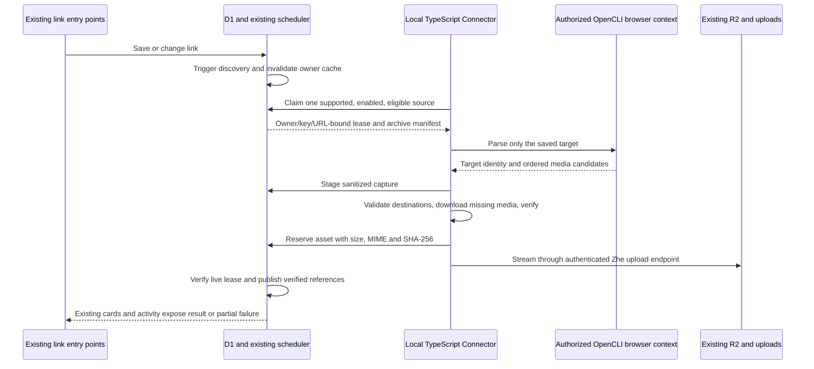

# Mainland Douyin and Instagram Media Connectors

Status: **proposed; not implemented**. Research and code baseline: 2026-09-27, Zhe `3e3145ffd53c94f9a359d7f10ee5fef84054eeea`.

This document extends the [X Connector design](25-x-bookmark-connector.md), [webpage previews](28-webpage-previews.md), and [enriched search](30-enriched-search.md). It does not replace their descriptions of currently deployed behavior. The architecture and thresholds below are proposals unless explicitly labeled **current**. No live Douyin or Instagram parsing, account login, media download, or production storage validation was performed for this research.

Navigation: [documentation index](README.md) · [architecture](01-architecture.md) · [testing](05-testing.md) · [maintainer operations](29-maintainer-operations.md).

## 1. Decision and scope

Extend the existing TypeScript CLI Connector and its one server-side scheduler. Reuse OpenCLI, Node streams, FFmpeg/ffprobe, D1, KV, R2, and the existing uploads manager. Implement small source-specific parsers; share job ownership, leases, download verification, publication, deletion, and presentation. Do not introduce Python/Go runtimes, another queue service, a desktop download application, a system capture proxy, or a trusted interception CA.

Mainland Douyin is first: `douyin.com`, `v.douyin.com`, and explicitly validated domestic mobile share forms. TikTok is a different platform with different APIs, signatures, sessions, and restrictions; its support is not evidence that Douyin works. Instagram public posts, carousels, and Reels are second. “Media” means both images and videos. The two outputs are durable Zhe archives and downloads of those archives to the user's device.

Only enrich a saved target link. Do not enumerate a user's platform bookmarks, likes, profile posts, comments, followers, or recommendations. Public availability does not establish copying or redistribution rights. Private, followers-only, paid, age-restricted, and DRM-protected content is outside the first implementation, even when a local account can view it.

The archive pipeline can provide deterministic integrity and ownership checks. Upstream availability cannot be guaranteed. In particular, current evidence does **not** establish reliable unattended Douyin single-post extraction. P0 must establish that prerequisite before schema work or automatic activation.

## 2. Current implementation and extension points

| Concern | Current evidence | Required evolution |
| --- | --- | --- |
| Link entry | `createLink()` in [actions/links.ts](../actions/links.ts); Webhook in [app/api/link/create/[token]/route.ts](../app/api/link/create/[token]/route.ts); REST in [app/api/v1/links/route.ts](../app/api/v1/links/route.ts); scoped writes in [lib/db/scoped/links.ts](../lib/db/scoped/links.ts) | Preserve ordinary saving, ownership, title, note, folders, tags, and short-link behavior. Media failure must not fail link creation. |
| Metadata | `enrichLink()` / `refreshLinkEnrichment()` in [lib/enrichment.ts](../lib/enrichment.ts) select Xray or HTML metadata | These are not the durable media queue. Adding a strategy here alone would not cover every creation path. No new authenticated global tweet cache. |
| Discovery | [0033_incremental_connector_discovery.sql](../drizzle/migrations/0033_incremental_connector_discovery.sql); `discoverConnectorLinks()` in [lib/connector/discovery.ts](../lib/connector/discovery.ts) | Existing insert/update triggers register source hints; consuming hints and creating jobs share a D1 batch. Extend this mechanism, including imports and SQL writes. |
| Scheduling | `claimConnectorJob()` / `connectorStates()` in [lib/connector/scheduler.ts](../lib/connector/scheduler.ts); `CONNECTOR_IDLE_SQL` in [lib/connector/jobs.ts](../lib/connector/jobs.ts) | Current sources are `github`, `x`, `screenshot`. One active lease per user is checked inside atomic claims. Source order uses `MAX(updated_at)`, not a dedicated successful-claim timestamp. |
| Authentication | `authorizeConnector()` / `jobParams()` in [lib/connector/http.ts](../lib/connector/http.ts); `ACTIVE_KEY_SQL` in [lib/connector/auth.ts](../lib/connector/auth.ts) | Keep active `connector:write` keys, user/key binding, expiry/revocation, rate-limited APIs, and live lease checks at mutation sites. |
| Local execution | `processOne()` / `watchConnector()` in [cli/src/connector/runtime.ts](../cli/src/connector/runtime.ts); `withOpenCliPage()` / `runOpenCliTask()` in [cli/src/connector/opencli.ts](../cli/src/connector/opencli.ts) | Current execution is serial, with a 20-second delay after each poll, a 180-second lease and 30-second renewal. Browser responses are isolated in a child. OpenCLI is pinned to `1.8.7`. |
| Contracts | `XPost`, `XMedia`, `canonicalXPost()`, `mediaUrl()` in [cli/src/connector/core.ts](../cli/src/connector/core.ts); [types.ts](../cli/src/connector/types.ts); `validateCapture()` in [lib/connector/validation.ts](../lib/connector/validation.ts) | Numeric X IDs, X fields/CDNs and a 16-item media limit are source-specific. A generic photo/video post must not impersonate an X tweet. |
| Download | `downloadMedia()` / `mediaResponse()` in [download.ts](../cli/src/connector/download.ts); `assertPublicMediaDns()` in [dns.ts](../cli/src/connector/dns.ts); `videoCandidates()` in [video.ts](../cli/src/connector/video.ts) | Preserve bounded streams, manual redirects, lengths, signatures, SHA-256, decode checks and posters. The current two-CDN DNS check is explicitly a preflight, not arbitrary-host DNS pinning. |
| Storage | `reserveXMedia()` / `writeXMedia()` in [lib/connector/media.ts](../lib/connector/media.ts); `completeXBookmark()` / `getXBookmarks()` in [jobs.ts](../lib/connector/jobs.ts) | Current X rows move through reserve/upload/verify/publish and reference `uploads`. Existing verified/published media is reused, but the CLI currently downloads before checking that reservation. |
| Cleanup | [0024_add_x_connector.sql](../drizzle/migrations/0024_add_x_connector.sql); `connectorStorageKeys()` / `drainR2Deletions()` in [lib/r2/gc.ts](../lib/r2/gc.ts) | Preserve URL-change invalidation, deletion tombstones, video/poster relationships, durable R2 deletion and orphan protection. |
| Activity/UI/search | [lib/connector/activity.ts](../lib/connector/activity.ts), [models/connector-activity.ts](../models/connector-activity.ts), [0035_add_connector_events.sql](../drizzle/migrations/0035_add_connector_events.sql), [link-card.tsx](../components/dashboard/link-card.tsx), [x-bookmark-content.tsx](../components/dashboard/x-bookmark-content.tsx), [useMediaDownload.ts](../viewmodels/useMediaDownload.ts), [lib/db/scoped/search.ts](../lib/db/scoped/search.ts) | Source unions, SQL joins, result JSON paths, UI contexts and download names are X-specific. Extend shared presentation without adding separate collection applications. |

Current `failXBookmark()` applies `min(1 hour, 60 seconds * 2^attempts)` after a failed execution; `completeXBookmark()` retries a partial result after a fixed five minutes. Eligibility stops after five attempts, including the first. Neither is a platform-wide 429 cooldown or a persistent CAPTCHA pause. These are proposal gaps, not existing guarantees.

## 3. Research evidence and implementation choice

### 3.1 Mainland Douyin

| Reference | Observed evidence | Decision |
| --- | --- | --- |
| [jiji262/douyin-downloader][jiji] at `9874f413` | MIT source; latest inspected main commit dated 2026-09-22. CLI is domestic Douyin only. README explicitly says request verification blocks individual video/photo, collection, music, likes and favorites downloads; refreshing cookies/retrying does not fix that block. Profile browser extraction is not guaranteed. | Borrow small URL/field-normalization ideas, not its runtime or a claim of working single-post downloads. |
| [putyy/res-downloader][resd] `4.0.0-beta.5`, source `7d2524e8` | Apache-2.0 with NOTICE; September 2026 beta releases, but maintainer warns of limited maintenance time. CLI/MCP controls a running desktop app and resources already captured through a proxy. | Not an autonomous saved-link parser. Do not install its proxy/CA or introduce its desktop runtime. |
| [F2][f2] | Apache-2.0. Development branch had September 2026 work, while the latest GitHub release inspected was `v0.0.1.7` from 2024. `fetch_one_video()` covers single-post data; image/live-photo fields and share resolution are useful references. | Reference schemas and failure cases only. Branch activity is not a successful live test. |
| [DouK / TikTokDownloader][douk] | GPL-3.0. README advertises domestic videos/albums but explicitly stops maintaining encrypted-parameter algorithms. | Do not transplant GPL implementation into the MIT CLI. Consult protocol facts without copying implementation. |
| [Evil0ctal Download API][evil] | Apache-2.0; `v5.1.1` released 2026-09-23. Main is a rewrite with PostgreSQL, Redis, identities and scheduling; old v4 is not the current architecture. | Duplicates Zhe infrastructure and increases credential/maintenance scope. Do not depend on its public demo. |

The useful jiji262 anchors are [`URLParser.parse()`][jiji-url], [`is_short_url()` / `normalize_short_url()`][jiji-validators], and [`_iter_gallery_items()` / `_collect_image_url_candidates()`][jiji-media]. They distinguish `/video/`, `/note/`, `modal_id`, short share links, and image arrays/candidates. Translate only the minimum required normalization into portable TypeScript with fixtures.

[`DouyinAPIClient.get_video_detail()` / `_request_json_gated()`][jiji-api] demonstrate why copying signing code is insufficient: browser SDK information is needed for gated requests, and the CLI has no equivalent working guarantee. Its optional [`build_app()` REST server][jiji-server] dispatches local download jobs; it does not supply Zhe's tenant/lease protocol. Its [Python dependencies][jiji-deps], database, retries, notifications and transcription would duplicate existing machinery. Douzy desktop releases and activation/plugin features must not be treated as capabilities proven by the open CLI. [Issue 247][jiji-issue] reports login verification failure; it is corroborating failure evidence, not a population success-rate estimate.

For res-downloader, version matters. The older master README described manual capture and included a non-commercial disclaimer alongside Apache; the inspected beta README consistently refers to Apache. The beta [automation contract][resd-automation] explicitly says it does not browse, log in, resolve arbitrary webpage URLs, or run independently of the desktop app. [`operations.go`][resd-operations] exposes `list_resources` and `create_download(resourceId)`. The [architecture][resd-architecture] stores resources, tasks, capture bytes and plugins locally. [`Engine.Start()`][resd-proxy] performs rule-selected HTTPS MITM; [certificate creation][resd-cert] and [macOS system integration][resd-macos] establish the additional trust and system-proxy boundary. The beta's local random control token does not remove that capture boundary. Douyin uses separately installed site plugins; no complete audit of those plugins or their licenses was performed. [Issue 287][resd-instagram] concerns Instagram capture failure on old 3.1.2, not a beta acceptance result.

### 3.2 Instagram and official APIs

The installed [OpenCLI Instagram parser][opencli-instagram] matches upstream `v1.8.7` source. `parseInstagramMediaTarget()` handles `/p/`, `/reel/`, and `/tv/`; `buildInstagramFetchScript()` uses the local browser session with the unofficial media-info endpoint, checks the target shortcode, and expands image/video/carousel media. Its helper currently discards some child IDs and dimensions, so a small parser-contract change is necessary. Calling the full `instagram download` command would bypass Zhe's downloader and write files directly; do not do that. [Issue 2247][opencli-issue] documents the previous persisted GraphQL query breaking.

[Instaloader][instaloader] is MIT, with `v4.15.3` released 2026-07-26 and September source activity. Its [troubleshooting guide][instaloader-limits] covers 429 and session/private-account restrictions. [gallery-dl][gallery] is GPL-2.0, with `v1.32.13` released 2026-09-19; it supports carousels/videos but adds Python and different licensing obligations. [yt-dlp][ytdlp] is a useful video reference, not evidence of complete photo-album support; its source and bundled binaries have different license compositions. None is added to Zhe by this design.

Official [Instagram Login API][ig-login] and [Facebook Login API][ig-facebook] principally serve authorized professional accounts. Facebook Login also supports limited discovery use cases, but neither is a universal resolver for arbitrary saved personal-account links. Instagram Login does not require a linked Facebook Page. [Basic Display ended on 2024-12-04][ig-basic]. [oEmbed][ig-oembed] provides an embed view and explicitly restricts other extraction/persistence uses; it is not the media-archive API. An authorized professional-account integration would require a separate OAuth scope decision, not silent substitution for the browser parser.

### 3.3 Cost and license boundary

| Approach | Maintenance consequence |
| --- | --- |
| Existing OpenCLI plus small TS source adapters | Preferred: no new language runtime; platform parsing remains the principal uncertainty. |
| A narrowly justified npm dependency | Consider only after checking existing dependencies/types. A controlled HTTP transport may justify an explicit dependency for DNS pinning; a downloader package does not solve platform access failures. |
| Python/Go service or desktop controller | Rejected: additional runtime, session storage, lifecycle, queue and upgrade obligations. |
| Interception proxy/CA, signature service or account pool | Rejected: broader traffic/credential authority and more moving parts than this feature requires. |

The inspected primary license files are [jiji262 MIT][jiji-license], [res-downloader Apache-2.0][resd-license] with [NOTICE][resd-notice], and [OpenCLI Apache-2.0][opencli-license]. MIT permits reuse with its copyright/license notice. Apache-2.0 permits reuse subject to license, attribution, modification notices and applicable NOTICE obligations; it does not grant endorsement rights. Preserve provenance for any translated code: changing programming languages does not remove license obligations. Reference-only design work does not authorize copying large implementations, closed desktop components or plugins with unverified licenses. Upstream README usage restrictions and dependency licenses must be reviewed at the pinned revision before any transplant. Software licenses do not authorize platform access or media redistribution.

## 4. One end-to-end lifecycle

The browser adapter must not call a downloader, export cookies, write an archive, or upload to Zhe. The CLI download layer fetches validated media candidates, and the server controls storage keys and ownership. R2 credentials remain server-only. Ordinary browser navigation may itself load page images/video; “metadata-only P0” means no media archiver or explicit media-body download, not a claim that browsing transfers zero media bytes.

## 5. Discovery, schema evolution and migration

### 5.1 Evolve existing media tables

Generalize `x_bookmarks` into proposed `media_bookmarks` for `source IN ('x','douyin','instagram')`, and `x_media` into proposed `media_assets`. These replace the old media job/asset tables; they are not additional queues beside X. GitHub and screenshot task tables retain their specialized payloads and continue using the same scheduler and lease helpers.

`media_bookmarks` retains `link_id` as its primary ownership root, `user_id`, exact `source_url`, `post_id`, state, attempt count, lease fields, draft/result data, removed-media identities and timestamps. Add `source`, `canonical_url`, expected media count, manifest completeness, and `auto_retry` to distinguish partial-but-terminal results. All participating task tables also receive `last_attempt_at` and `execution_deadline_at` for claim ordering and bounded renewal. A saved link has at most one media-source job. A composite owner/source/link constraint on the parent and matching asset foreign key prevents mismatched attachment ownership.

`media_assets` retains asset IDs, R2 keys, upload IDs, MIME, sizes, hashes, resolution, lease token and reservation states. Store `source`, `post_id`, `media_id` and `kind`; uniqueness is `(user_id, link_id, source, post_id, media_id, kind)`. The canonical content identity is source + post + child-media ID; link/user scope deliberately prevents cross-tenant or cross-link attachment sharing. This is retry idempotence, not global content deduplication. Repeated saves may remain separate bookmarks. Do not deduplicate on expiring CDN URLs or array index alone. Prefer provider child IDs or a proven stable image-resource key; if neither is available, fail that item's identity validation rather than risk reusing the wrong file.

Keep X-specific text/metrics in an X payload within the shared capture envelope. Other sources have optional caption/author data and an ordered item manifest, without invented X metrics. The server capture contains no cookies, arbitrary headers, or expiring media URLs. The local-only candidate list is separate. Migrate existing X payloads deterministically and preserve published asset metadata; do not re-download X archives as part of migration.

### 5.2 Reuse discovery triggers

Extend the CHECK constraints and triggers from migrations 0033 and 0035 to recognize five scheduler sources. SQL triggers remain simple durable hints; strict URL parsing stays in the application/CLI. Inserts and original-URL changes register source hints; uniqueness `(user_id, source, link_id)` makes repeated hints harmless. No network request runs inside a link write or trigger.

During discovery, consume a bounded batch of hints, create/update only eligible source jobs, and acknowledge exactly that batch in one D1 transaction. Do not retain the current delete-all-hints behavior if discovery becomes paginated. A failed transaction leaves its hints intact. Concurrent URL changes cannot be acknowledged against an older URL. Backfill existing links once through a migration; do not scan all links on every poll. Title/note/folder/tag changes do not requeue media. An original URL change continues to invalidate old capture, lease, assets and history, even if normalization later finds the same post.

Source classification precedes generic screenshot classification. Known X, Douyin and Instagram domains, including recognized short-share hosts, must not silently become screenshot work when their media parser is paused or unsupported. Existing user-supplied previews are preserved; task-generated obsolete previews follow their existing cleanup rules. No profile-page fallback that enumerates posts is allowed.

For application writes, retain `connectorUserId` invalidation at the D1 mutation site. [worker/src/d1-proxy.ts](../worker/src/d1-proxy.ts) and [connector-cache.ts](../worker/src/connector-cache.ts) continue caching advisory readiness/state/history under the current owner namespace. SQL-only writes still lack an immediate KV notification and can wait for cache expiration. Cached data never authorizes a claim, resume, publication or rate-budget reset.

### 5.3 Future migration sequence

Do not edit applied migrations 0024, 0026, 0027, 0028, 0031, 0033 or 0035. Allocate new migration numbers after the actual head at implementation time; no migration number is reserved by this document.

1. Build and test the migration against synthetic copies of current schemas: generalize X tables, preserve keys/IDs/tombstones, transform captures and recreate affected foreign keys, indexes and triggers. Table rebuilds must suppress old deletion triggers while copying so migration cannot enqueue live archives for deletion.
2. Rebuild discovery/event source constraints and event triggers; preserve historical event IDs and mark any synthesized history as snapshots. Update search invalidation triggers and migrate X search projections without indexing draft/media URLs.
3. Add the small source-policy table described below. Seed existing sources enabled and both new sources disabled; seed last-service values from available history as an approximation. Backfill hints without consuming media or retrying completed X jobs.
4. In a separately authorized cutover, quiesce claims, drain or expire existing leases, apply the migration, and deploy matching server/CLI code. Use an explicit Connector protocol revision so old X-only clients are rejected clearly before claiming. Replace old media endpoints/types; no dual writes, compatibility views or parallel scheduler.
5. Validate X/GitHub/screenshot behavior before enabling a new source. A migration failure rolls back the transaction. After cutover, pause a failing new source while preserving migrated X operation. Do not run an old binary against the new schema. Any full restore requires a coordinated database/application recovery plan and separate authorization.

Migration rehearsal must cover D1 with recursive triggers disabled, backup/export/import mappings, storage audit, local test bootstrap and shared payload consumers. Neither quiescing Connector processes nor executing migrations is authorized by this document-only change.

## 6. Shared scheduling, fairness and bounded execution

### 6.1 One scheduler, five sources

Extend `claimConnectorJob()` rather than creating another service or watch loop. A static source registry identifies each source's task table/filter, discovery function, claim operation and typed completion handler. Repeated `media_bookmarks` queries must include the specific source predicate. All claim handlers share the same eligibility, active-key and owner-wide idle predicates. The idle predicate includes media, GitHub and screenshot rows, regardless of the requesting client's advertised capabilities.

Add proposed `connector_source_policy`, keyed by `(user_id, source)`, containing `enabled`, `pause_reason`, `cooldown_until`, `next_claim_at`, `last_claimed_at`, `rate_limit_streak`, and UTC-day attempt accounting. It contains no task payload, queue, browser cookie or upstream account secret. It supplies durable eligibility and quota data to the existing scheduler; restarting a CLI or changing API keys must not reset it.

Source selection uses least-recently **successfully claimed** eligible source, with a fixed tie order preserving existing sources before new sources. Discovery/polling/heartbeats/failures do not advance `last_claimed_at`; a successful claim does, even if processing subsequently fails. This avoids `updated_at` being altered by unrelated heartbeat or UI operations. Implementation priority is Douyin first; it does not receive runtime priority over X. After bounded discovery, the authoritative selection considers actual eligible job rows, not merely outstanding hints; a source with only malformed/unprocessed hints must not block another source's claim.

Use an atomic D1 batch to select/recheck the supported eligible source, claim one job, increment its attempt, update its source claim timestamp and consume its quota. Tie policy/quota updates to the newly generated lease token. No successful job claim means no consumed budget. Cached ordering may suggest a candidate, but the transaction must recheck source priority, enabled/pause/cooldown state, budget, job URL and ownership, Key validity, lease expiry and global idle state. A loser returns idle or recomputes a bounded candidate set; it must not spin.

Within one source, select eligible jobs by oldest `last_attempt_at` (never-attempted first), then link ID. Add that explicit timestamp to participating task tables instead of using heartbeat-updated timestamps. Limit discovery/classification work per source per poll, including malformed URLs, so unclaimable hints cannot monopolize scheduling.

With all five sources supported by a polling client, continuously eligible and within budget, each gets a turn within five successful claims. This is conditional fairness, not a wall-clock SLA: offline clients, unsupported sources, exhausted quotas and paused sources are ineligible. Bound each execution so a healthy but very large job cannot retain the only lease indefinitely. Unsupported-source UI must explain the missing client capability rather than imply progress.

### 6.2 Proposed initial limits

These are conservative application budgets, not platform-published safe rates. Change them only with recorded evidence.

| Budget | Proposed behavior |
| --- | --- |
| Concurrent jobs | One active lease per Zhe user across all five sources, enforced in D1; each CLI also stays serial. |
| Browser identity | One designated local browser context per source/user in the initial setup. Do not run multiple Zhe identities against the same upstream account concurrently; quota aggregation across such setups is not provided. |
| Lease/heartbeat | Retain 180 seconds / 30 seconds. Add an absolute six-minute execution deadline checked by renewal; heartbeat cannot extend beyond it. |
| Polling | Retain the existing 20-second post-task poll delay. No independent per-platform poller. |
| New-source claims | At most one Douyin or Instagram attempt per minute per user/source, burst one; at most 30 claimed attempts per source per UTC day initially, including manually triggered execution. Persist counters atomically. Existing sources retain their current polling cadence. |
| Parser requests | One saved target, at most two explicit metadata requests per attempt, 120-second parser timeout; no pagination through unrelated content. Browser-generated asset requests are not equivalent to these explicit request counts. |
| Media transfer | Serial per job; retain 120-second per-file deadline, 10 MiB images and 100,000,000-byte videos. For new sources, cap an attempt at 200 MB of incoming primary media and 32 manifest items. Count failed/aborted transfers toward the attempt byte budget. |
| Automatic retries | At most five claimed attempts per job cycle, including first execution and expired/crashed attempts. No automatic reset on URL rediscovery, reconnect or process restart. |

At an execution/byte boundary, finish publishing already verified items if the lease remains valid, report partial progress and release the lease. Future eligible attempts skip archived items. Oversize manifests are explicit unsupported results, not silently truncated albums. Exhaustion after five attempts remains visible for deliberate manual requeue.

Zhe API rate limiting and upstream rate limiting are separate. Heartbeats/upload operations must fit the existing API-key limit, but successful Zhe requests do not imply remaining Instagram/Douyin allowance. Per-source budgets cannot account for unrelated phone/browser use of the same account; a CAPTCHA or account warning still stops automation.

## 7. Browser parsing, URL security and media integrity

### 7.1 Source adapters

Proposed portable modules under `cli/src/connector/` separate canonicalization and pure capture normalization from browser interaction. Extend `types.ts` with explicit `source` on every job, a shared media envelope, ordered item IDs, expected count and manifest completeness. Keep source-specific URL grammar and content fields in their own modules. Share runtime/archive code rather than copying `processOne()` per platform.

| File boundary | Proposed implementation work, not present today |
| --- | --- |
| `cli/src/connector/douyin-core.ts`, `instagram-core.ts`, source reader modules | Pure `canonicalDouyinPost()` / `normalizeDouyinCapture()` and Instagram equivalents; browser readers return local candidates separately from the server capture. New filenames are proposed. |
| [cli/src/connector/opencli.ts](../cli/src/connector/opencli.ts), [runtime.ts](../cli/src/connector/runtime.ts), [download.ts](../cli/src/connector/download.ts), [dns.ts](../cli/src/connector/dns.ts) | Extend the typed browser facade with verified capture/navigation capabilities; dispatch one reader in `processOne()`; share bounded downloads, destination policy and cleanup. Do not modify installed `node_modules` in place. |
| [lib/connector/jobs.ts](../lib/connector/jobs.ts), [media.ts](../lib/connector/media.ts), [validation.ts](../lib/connector/validation.ts), [scheduler.ts](../lib/connector/scheduler.ts) | Generalize media claim/stage/complete/reserve/write functions, share lifecycle helpers, add authoritative source-policy checks and keep one scheduler. |
| [app/api/v1/connector/route.ts](../app/api/v1/connector/route.ts), [current media route](../app/api/v1/connector/jobs/[id]/media/[assetId]/route.ts), [cli/src/api/client.ts](../cli/src/api/client.ts) | Retain the common claim endpoint; replace X-only media action/upload paths with one typed media route family during protocol cutover. Advertise explicit supported sources; the server independently authorizes them. |
| [contexts/x-bookmarks.tsx](../contexts/x-bookmarks.tsx), [viewmodels/useXBookmarks.ts](../viewmodels/useXBookmarks.ts), [actions/connector.ts](../actions/connector.ts), [models/x-bookmarks.ts](../models/x-bookmarks.ts) | Extract shared media state/loading without inventing X metrics for other sources. Keep X-specific filters and details; update all callers in the same cutover. |
| [models/connector-activity.ts](../models/connector-activity.ts), [lib/connector/activity.ts](../lib/connector/activity.ts), [lib/db/scoped/search.ts](../lib/db/scoped/search.ts), [lib/ai/link-context.ts](../lib/ai/link-context.ts) | Extend source/manifest handling, keep current URL/owner checks, and migrate every consumer of X capture JSON to the shared envelope. No new AI media interpretation is included. |

Define the media route family and protocol revision with the shared contract change, then remove the superseded X route handlers in that same release. Do not ship two competing upload lifecycles. Update [lib/db/schema.ts](../lib/db/schema.ts), migration fixtures and backup mappings alongside the SQL changes described in section 5.

For Douyin, normalize supported domestic share links with strict URL parsing, preserve the original link, and resolve to one numeric aweme ID. Use the existing OpenCLI browser bridge to observe the saved page's normal detail response; accept data only when the response identity matches the requested post. The installed OpenCLI has `startNetworkCapture()` / `readNetworkCapture()`, but runtime extension support and response-body availability are not established by their type declarations. Do not assume a bare browser `fetch()` automatically acquires every required signature. If the normal browser path cannot expose a complete manifest, report parser unavailable and stop this source's rollout.

For Instagram, reuse the pinned OpenCLI target/metadata approach, with a minimal normalized result retaining child IDs, dimensions and manifest completeness. Missing optional caption/metrics is acceptable; missing media is not a successful empty post. Do not invoke OpenCLI's file-writing download command. Pin dependency contracts and classify changed adapters separately from login failures.

Site cookies stay in the selected browser context. Authenticate to Zhe with the existing key, independently from site authentication. Do not export cookies from the browser/keychain, store them in D1, send them to a parser service, rotate accounts, solve CAPTCHAs, or bypass access checks. Source enablement and session usage require an explicit user decision. Neither the `access: read` label nor an ephemeral OpenCLI session proves anonymous operation; P0 must verify the actual context has no target-site login.

### 7.2 Destination policy

Treat every page, redirect and candidate URL as untrusted, including output from a trusted library. Maintain separate policies for saved-page/share hosts and media CDN hosts. Use exact hosts or narrowly justified suffixes with label boundaries; do not allow all of a cloud/CDN provider's domains. Reject userinfo, unexpected ports, non-HTTPS schemes, local addresses, malformed hosts and unapproved redirects. Query normalization for identity must not strip required signed parameters from the actual fetch URL.

Resolve short shares with a bounded manual redirect chain, checking every destination before requesting it; reject loops and unsupported mobile application schemes. Inspected third-party short-link helpers that use automatic redirects are not safe to copy unchanged. Proposed maximum is five share redirects; media retains the current maximum of two redirects. The actual allowed mobile hosts and CDN families remain a P0 deliverable, not a guessed allowlist.

For CLI media/share fetches, resolve A/AAAA, reject any non-public result and bind the actual connection to an approved resolved address while retaining hostname TLS verification/SNI. Re-resolve and revalidate each permitted redirect. A separate DNS-over-HTTPS check followed by an independent fetch is not sufficient against rebinding. Existing X fixed-host policy must not be weakened while this transport is introduced. Inspect installed HTTP libraries before adding a small explicit dependency; if a configured proxy owns DNS resolution and the destination cannot be verified, fail the new-source request rather than silently widening access. Do not change system proxy settings.

Allow only fixed source-specific request headers justified by P0, such as an approved Referer. Never forward caller-supplied Authorization/Cookie headers to CDN redirects. A media endpoint requiring export of the site's browser session is unsupported in the initial implementation. Expiring signed URLs remain local and absent from logs, search and public API responses.

Browser navigation has a different boundary from a pinned Node connection: the browser can load scripts/subresources from third parties. Restrict the owned tab to approved top-level destinations, reject unsafe redirects, and never follow arbitrary links from returned content. P0 must verify that the available bridge can enforce the required navigation guard before enabling automation. Do not describe Node DNS pinning as protecting all browser traffic; inability to constrain navigation is a rollout blocker, not justification for a system MITM proxy.

### 7.3 Integrity and supported formats

Retain declared Content-Length checks, cancellation before an oversized body, streaming byte counts, file-signature validation, SHA-256, private temporary files, ffprobe metadata and full FFmpeg decoding. A missing/invalid length remains unsupported in the first version; do not silently accept an unbounded stream. The server rechecks size, signature and digest rather than trusting CLI metadata, and R2 upload continues using its checksum. Decoding remains local, not a Worker responsibility.

Initially accept JPEG, PNG, WebP, and browser-playable MP4 renditions. Verify codecs as well as container before declaring video playable; prefer H.264/AAC where offered. Preserve existing X video selection/quality behavior. For new sources, select the best supported rendition within limits without inventing resolution from the requested variant. HLS/DASH merging, separate audio, HEVC-only content, original-upload recovery and arbitrary transcoding are later decisions. Live photos/animated album entries cannot be silently flattened to still images and marked complete.

Record all expected items and explicit unsupported/failed items. Stable child ID, ordering and expected count must survive normalization. `complete` requires a demonstrably complete manifest and every required, non-deleted primary item published. A verified video may publish without a poster, with a warning; a poster alone never counts as a completed video. Decoding and hashing do not prove highest available quality, authorship, rights or authenticity.

## 8. Reserve, publication, retry and cancellation

Retain one shared media state machine for X, Douyin and Instagram:

| State/transition | Rule |
| --- | --- |
| Job `pending` -> `running` | Atomic claim acquires owner/key/token/URL-bound lease and consumes one attempt and source budget. |
| `capture` | Server validates the job's source/post identity and sanitized manifest, filters explicit removal tombstones, and stages it under the live lease. |
| Asset `reserved` -> `uploading` -> `verified` | `reserveXMedia()` / `writeXMedia()` become shared media operations. Server generates the random object key; only one reserved writer can transition. Completion rechecks the current clock and live lease. |
| `publish` -> job `complete` or `partial` | One D1 batch creates uploads references, marks verified assets published, updates source metadata and result/state, and invalidates caches. R2 and D1 are not a distributed transaction; failed/stale writes enter durable cleanup. |
| Job `failed` | No usable capture; preserve any previous published result separately. Safe error code determines automatic eligibility. |
| Job `unavailable` | Deleted/unsupported/restricted target; no automatic retry. |
| Source paused | Orthogonal source-policy gate, not a second job queue or an invented successful state. Existing job results remain readable. |

Return the owned archived/tombstoned asset manifest with the claim so the CLI can skip existing bytes before downloading. Revalidate reuse/reservation on the server to cover deletion races. Idempotence compares stable media identity; SHA-256 establishes the archived file's integrity, not a license to reuse another user's file. If upstream changes the manifest incompatibly, keep the old published snapshot and report the conflict rather than relabeling an existing file. Explicit deletion tombstones win over refresh/requeue.

Unify retry classification for the three media sources. GitHub/screenshot keep their payload semantics while sharing owner exclusion, claim budgets where applicable and safe error handling.

| Failure | Proposed handling |
| --- | --- |
| Network timeout, 5xx, interrupted attempt, transient partial media failure | Persist `next_attempt_at = now + min(1 hour, 60 seconds * 2^attempts) + bounded jitter`. Apply to partial and failed media jobs; do not retry inside both parser and outer job loops. |
| 429 | Release lease; persist source-wide cooldown using the later of valid Retry-After and exponential backoff. Never retry earlier than Retry-After. Without it, start at 15 minutes. Three consecutive 429 attempts pause that source until explicit resume. Cooldown excludes the source so other work continues. |
| Login required, CAPTCHA/checkpoint, deterministic request-verification rejection | Save `needs_login`, `challenge_required` or `request_verification_blocked`; set source pause and disable automatic job retry. User review/resume is required; no automatic challenge handling. |
| Unsupported media or item-local download failure | No automatic retry for a terminal item error. With an otherwise validated public manifest, publish independently verified permitted items as partial, with `auto_retry=false` when no retryable work remains. |
| Invalid target identity/manifest, private/deleted target or unsafe top-level URL | Reject the whole new capture and publish no new assets. Preserve an earlier archive according to the explicit retention policy; do not treat target rejection as permission to publish a partial private capture. |
| Lease lost or Zhe Key revoked/expired | Abort browser/download/upload work. No subsequent capture or publication may succeed. An unreportable failure is reclaimed after lease expiry; attempts still count. |
| Attempt/source quota exhausted | Preserve progress and show exhaustion/next eligible time. Manual requeue may reset the job cycle, but cannot erase source cooldown, daily quota or deletion tombstones. |

Manual source resume is separate from retrying a link, authenticated and tenant-scoped. It checks the current pause/cooldown and records a safe activity event. Resuming a source does not automatically requeue terminal jobs; the user must also requeue the selected job to restore `auto_retry` for a new bounded cycle. Successful unchallenged parsing resets the consecutive-429 streak; a challenge on the next authorized parse pauses again. The server cannot verify that a platform challenge was resolved merely because a button was clicked.

Cancellation closes only the owned browser context, stops the owned child, removes its local partials and prevents further renewals. Key revocation is checked on subsequent API operations and at every write, including upload completion; it does not magically interrupt an already-open upstream socket. The next heartbeat aborts local work, and no stale result may publish. Deleting/changing the link invalidates its lease immediately in D1.

## 9. Storage, deletion, privacy and presentation

New objects use the existing bucket and server-generated user-hashed prefix, with source/post/link components and a random asset ID. Preserve old X object keys during migration. Extend the current deletion triggers and `r2_deletions` queue rather than creating source-specific cleaners. Cover link deletion, original-URL change, upload deletion, video/poster cascades, failed uploads and expired staging objects. GC must protect every live reservation and published reference before deleting, recheck references at drain time, and re-enqueue late failed writes. Test without recursive SQLite triggers.

Existing archives use `R2_PUBLIC_DOMAIN`. Link visibility, dashboard authentication and unguessable keys do not make the media private. Do not archive restricted content into that namespace. Supporting private content requires a separately approved authenticated media-serving design, cache/Range behavior, retention and revocation policy. Archive removal is not automatic when an upstream author later deletes or restricts a post; users need the existing explicit deletion path and a clear retention decision.

Generalize the media context/ViewModel, renderer and `useMediaDownload()` while retaining X-specific presentation where useful. Keep `/dashboard/x` filtered to X; new sources appear in existing links/folders and shared details, without new dedicated pages. Use Basalt tokens and compact controls. Preserve `links.title` and `links.note`; source refresh changes source metadata only, following [unified link organization](31-unified-link-organization.md).

Extend activity/source filters, readiness summaries and events to show queued, running, partial, terminal, paused, cooling-down, unsupported-client and exhausted conditions honestly. Show published/expected item counts and safe failure reasons, not raw upstream messages or signed URLs. Event changes must not flood history on heartbeat. Search consumes only current-owner/current-URL published captures and is dirtied at mutation sites. Download names use source/post/media identity rather than a hardcoded `x-` prefix; the browser saves Zhe archive URLs, not upstream cookies or signed candidates.

## 10. Implementation and acceptance sequence

Each stage is a separately reviewable implementation change. This documentation commit implements none of them. No estimated effort or claimed live success is implied.

### P0: metadata-only feasibility, before schema changes

1. Obtain approval for a bounded set of public/self-owned or explicitly authorized samples: a domestic single video, image album, `v.douyin.com` share, relevant domestic mobile variant, Instagram image, mixed carousel and Reel. Do not use production queue admission as a test harness.
2. Use an isolated OpenCLI-owned context verified to be anonymous for the target site. Record browser/extension/OpenCLI versions and which capture/navigation capabilities actually work. Existing `siteSession: ephemeral` is not sufficient proof that cookies are absent.
3. Resolve/parse one target at a time. Record canonical identity, observed visibility, expected count, item IDs/order, media types/dimensions, safe CDN host/path categories and failure code. Keep signed URLs/raw responses out of committed fixtures and logs. No explicit media-body fetch, file download, reserve, upload or production write.
4. If anonymous access returns a login wall, stop that sample and record it. Only after explicit authorization may the user log in locally and permit reuse of that named session. Do not automate login or export cookies. Re-test public/authorized samples; a challenge is a stop condition, not a test to bypass.
5. Compare the manifest against the visible target, test the anonymous/authorized distinction, and confirm that the parser does not return recommendations or omit album entries. A missing/unstable child identity, unguarded navigation, unavailable response body or unproven visibility must be reported as a failed acceptance condition.
6. Produce a source-specific evidence record: exact versions, sample category/count, anonymous versus authorized outcome, complete/partial failures, sanitized host-policy findings and remaining gaps. Source code support alone cannot pass P0.

Failure exit: retain ordinary links and existing connectors, leave the failed source disabled, and revise this design. Do not proceed by installing a signing service, a proxy/CA or another language runtime. Douyin and Instagram pass independently; failure of one does not justify enabling it alongside the other.

### P1: synthetic archive loop and schema rehearsal

Use pure TS fixtures and generated JPEG/PNG/WebP/MP4 media with the existing isolated test stack. Implement the shared media table/contract evolution, discovery, one scheduler, destination policy, verification, reserve/upload/publish, deletion and existing-card presentation. Preserve X behavior first; then connect synthetic Douyin/Instagram payloads. New real sources remain disabled.

Acceptance: deterministic migration counts/foreign keys/object references, no accidental R2 deletion records, no re-downloading migrated X media, verified byte-for-byte uploads, complete versus partial accounting, working synthetic video playback and file saving, source-specific names, unchanged user title/note, and healthy X/GitHub/screenshot journeys. Failed migration/loop checks stop rollout; retain the current deployed code and data rather than releasing a half-migrated product.

### P2: safety, scheduling and failure tests

| Test surface | Cases and existing homes |
| --- | --- |
| Pure contracts and HTTP transport | URL grammar, mobile shares, ID mismatch, duplicate/missing children, malformed/oversize manifests, changing signed queries, redirect loops, private/mixed DNS, rebinding, unsafe proxies/headers, MIME/signature/length/digest mismatch, decode/codec failures. Extend [CLI connector tests](../cli/tests/connector-core.test.ts), [download tests](../cli/tests/connector-download.test.ts), [video tests](../cli/tests/connector-video.test.ts) and [server validation tests](../tests/unit/connector-validation.test.ts). |
| Real D1 scheduling | Concurrent clients/keys, unsupported clients, all five backlogs, malformed discovery, bounded consumption with concurrent inserts/URL changes, stale KV ordering, last-claim ordering, job deadlines, cooldown/exhaustion/pause and manual retry. Extend [connector-jobs.test.ts](../tests/unit/connector-jobs.test.ts). Assert one active user lease, no budget consumed by lost claims, conditional five-source fairness, and no quota reset on restart/key rotation. |
| Live lease/write races | Revoke/expire key or change/delete URL during browser work, reserve, upload and publish; expire lease on attempt five; interrupt between R2 write and D1 publication; explicit asset removal versus late retry. No stale/foreign publication or resurrected media. |
| HTTP and cleanup | Use [tests/api/v1/connector.test.ts](../tests/api/v1/connector.test.ts) with local D1/R2 for complete/partial manifests, conflicting duplicate PUT, GC staging protection, deletion queue recovery and source-specific route authorization. No production resources. |
| Browser/UI | Use [connector.spec.ts](../tests/playwright/connector.spec.ts), [connector-panel.test.tsx](../tests/unit/connector-panel.test.tsx), [media-download.test.tsx](../tests/unit/media-download.test.tsx) and existing card tests for synthetic playback, paused/cooling/exhausted labels, existing X filters, late URL updates, cancellation and compact responsive presentation. |
| Static/security gates | Follow current [AGENTS.md](../AGENTS.md) commands and actual enforcement. Cover all four L1 metrics, strict types/lint, L2/L3, dependency/secret scans and isolated D1 fixtures; do not describe planned repository-wide thresholds as already enforced. |

Failure exit: block release, keep both new sources disabled, and fix the relevant shared invariant before accepting platform success. Tests must distinguish synthetically proven archive behavior from upstream feasibility.

### P3: separately approved real downloads

Obtain explicit approval for exact small samples, named session usage, byte/count limits and storage destination/access policy. This is separate from P0 metadata/session authorization. Start with a single eligible source and manual one-job execution in isolation; do not silently attach an experiment to the daily watcher or enable an account-wide backfill.

Acceptance: complete album ordering/count, real video/audio playback, measured bytes/hash, provenance, no secret leakage, safe retry behavior, and confirmed deletion/GC. Record failures and unsupported variants as well as successes. If platform verification fails, pause the affected source while preserving saved links and existing X/GitHub/screenshot work. Only a further release/operations decision enables continuous collection, applies production migrations, or changes a running Connector service.

## 11. Remaining decisions and non-guarantees

- P0 must establish actual Douyin/Instagram parser behavior, public-visibility evidence, stable child IDs, browser navigation restrictions and safe media-host policies. Until then, both sources are proposals.
- Anonymous public access may require login or be denied; an authorized session may still be throttled or challenged. Public and authenticated-public outcomes must be reported separately.
- Native-app-only shares, expired URLs, deleted/private/paid/region-limited content, live streams, live photos, new codecs, original quality and watermark-free variants are not guaranteed. Never fabricate missing metadata or silently call a partial album complete.
- A normal browser session avoids maintaining custom signing algorithms but does not provide an upstream API contract or authorization to bypass restrictions.
- Initial quota values are local protective budgets, not assurances against account restrictions. No multi-account identity rotation or cross-user browser-account quota system is included.
- Public archive access, retention after upstream deletion, and any later private-media support require explicit product decisions. Platform API permission, content rights and code licenses are independent.
- Research used public repositories/docs only. Anonymous GitHub API rate limits were encountered; public Raw/HTML/Atom sources supplied the additional evidence. Some general platform-terms pages returned only shells, so no unseen terms were quoted or declared satisfied.

## 12. Evidence maintenance

Keep this document as the design source of truth. Update status, code baseline, pinned upstream references and stage evidence when implementation changes the proposal. Replace current/proposed descriptions deliberately; do not append contradictory completion claims. Runtime configuration facts belong in `AGENTS.md`/deployment docs once shipped; incidents belong in `Retrospective.md`.

The dated release/commit observations above measure maintenance activity, not reliability. Recheck license files, README limitations, relevant issue status and exact package contracts at implementation time. The links below are research references, not endpoints to invoke for user-media downloads.

[jiji]: https://github.com/jiji262/douyin-downloader/blob/9874f413b2c1f8ad6e731b26e3e05f402fc964f8/README.md
[jiji-license]: https://github.com/jiji262/douyin-downloader/blob/9874f413b2c1f8ad6e731b26e3e05f402fc964f8/LICENSE
[jiji-url]: https://github.com/jiji262/douyin-downloader/blob/9874f413b2c1f8ad6e731b26e3e05f402fc964f8/core/url_parser.py#L13
[jiji-validators]: https://github.com/jiji262/douyin-downloader/blob/9874f413b2c1f8ad6e731b26e3e05f402fc964f8/utils/validators.py#L66
[jiji-media]: https://github.com/jiji262/douyin-downloader/blob/9874f413b2c1f8ad6e731b26e3e05f402fc964f8/core/downloader_base.py#L1524
[jiji-api]: https://github.com/jiji262/douyin-downloader/blob/9874f413b2c1f8ad6e731b26e3e05f402fc964f8/core/api_client.py#L710
[jiji-server]: https://github.com/jiji262/douyin-downloader/blob/9874f413b2c1f8ad6e731b26e3e05f402fc964f8/server/app.py#L129
[jiji-deps]: https://github.com/jiji262/douyin-downloader/blob/9874f413b2c1f8ad6e731b26e3e05f402fc964f8/pyproject.toml
[jiji-issue]: https://github.com/jiji262/douyin-downloader/issues/247
[resd]: https://github.com/putyy/res-downloader/tree/7d2524e8cbf1f88f38b980e08b2075cb4f962403
[resd-license]: https://github.com/putyy/res-downloader/blob/7d2524e8cbf1f88f38b980e08b2075cb4f962403/LICENSE
[resd-notice]: https://github.com/putyy/res-downloader/blob/7d2524e8cbf1f88f38b980e08b2075cb4f962403/NOTICE
[resd-automation]: https://github.com/putyy/res-downloader/blob/7d2524e8cbf1f88f38b980e08b2075cb4f962403/docs/zh/guide/automation.md
[resd-operations]: https://github.com/putyy/res-downloader/blob/7d2524e8cbf1f88f38b980e08b2075cb4f962403/internal/automation/operations.go#L19
[resd-architecture]: https://github.com/putyy/res-downloader/blob/7d2524e8cbf1f88f38b980e08b2075cb4f962403/docs/zh/development/architecture.md
[resd-proxy]: https://github.com/putyy/res-downloader/blob/7d2524e8cbf1f88f38b980e08b2075cb4f962403/internal/proxy/engine.go#L66
[resd-cert]: https://github.com/putyy/res-downloader/blob/7d2524e8cbf1f88f38b980e08b2075cb4f962403/internal/system/certificate.go#L129
[resd-macos]: https://github.com/putyy/res-downloader/blob/7d2524e8cbf1f88f38b980e08b2075cb4f962403/internal/system/platform_darwin.go
[resd-instagram]: https://github.com/putyy/res-downloader/issues/287
[f2]: https://github.com/Johnserf-Seed/f2/tree/c2c52a4da0cfe0ce646cc836738d7f1aca1308f8
[douk]: https://github.com/JoeanAmier/TikTokDownloader/tree/473c90ff70c663cfb69310fff2b8d5192f200661
[evil]: https://github.com/Evil0ctal/Douyin_TikTok_Download_API/releases/tag/v5.1.1
[opencli-instagram]: https://github.com/jackwener/OpenCLI/blob/87b60a36590c3e2a466c37266c3348d73d7f68fe/clis/instagram/download.js#L115
[opencli-license]: https://github.com/jackwener/OpenCLI/blob/87b60a36590c3e2a466c37266c3348d73d7f68fe/LICENSE
[opencli-issue]: https://github.com/jackwener/OpenCLI/issues/2247
[instaloader]: https://github.com/instaloader/instaloader/releases/tag/v4.15.3
[instaloader-limits]: https://instaloader.github.io/troubleshooting.html
[gallery]: https://github.com/mikf/gallery-dl/releases/tag/v1.32.13
[ytdlp]: https://github.com/yt-dlp/yt-dlp
[ig-login]: https://developers.facebook.com/docs/instagram-platform/instagram-api-with-instagram-login/?locale=en_US
[ig-facebook]: https://developers.facebook.com/docs/instagram-platform/instagram-api-with-facebook-login/?locale=en_US
[ig-basic]: https://developers.facebook.com/blog/post/2024/09/04/update-on-instagram-basic-display-api/?locale=en_US
[ig-oembed]: https://developers.facebook.com/docs/instagram/oembed/?locale=en_US
